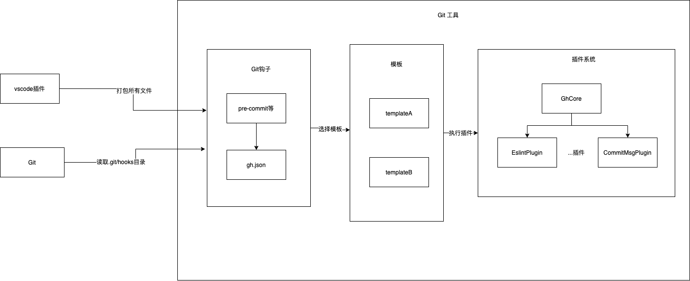

# 简介

node 版本的 git hooks 模板库

## 目录结构

```shell
.
├── assets
│   └── git-hooks
│       ├── commit-msg // git脚本入口
│       ├── gh.json // git脚本配置文件，指定对应的template模板
│       ├── pre-commit // git脚本入口
│       └── templates // 各类模板
│           └── template1 // 默认模板
├── rollupConfig // 打包配置
│   ├── rollup.cjs.js
│   └── rollup.common.js
├── src // 插件系统
│   ├── constants.ts // 常量，如插件集合
│   ├── core.ts // 插件核心，提供插件安装、插件运行
│   ├── index.ts
│   ├── interface.d.ts
│   └── plugins // 各类插件，供模板文件调用
│       ├── commit-check-plugin
│       ├── commit-message-plugin
│       ├── eslint-plugin
│       └── logger-plugin
├─── tsconfig.json
└── ...
```

## 原理

### 系统架构图



主要分为 3 部分

- git 钩子入口
- 模板文件
- 插件系统

### 一、git 钩子入口

该部分主要是 git 可识别的文件，如不带任何后缀的 pre-commit、commit-msg 等脚本文件。这些文件都会做两件事情：

1. 读取 gh.json，获取对应模板的同名执行文件
2. 执行同名文件

如下所示：

```js
#!/usr/bin/env node
...
const config = require(配置路径)
// 根据当前配置执行对应模板的文件
const templatePath = path.resolve(
  repositoryPath,
  './.git/hooks/templates/',
  config.template,
  'pre-commit.js'
);
require(templatePath);
```

### 二、模板文件

该部分主要是各类和钩子同名的执行文件，其任务是统筹和组织各个插件的执行逻辑。

#### 为什么要做模板文件管理？

假设在某个项目中的 commit-msg 可能既要做 commit 提交格式检测、又要打上 eslint 检测通过的 tag，但是在另一个项目中可能默认没有集成 eslint，只需要做 commit 提交格式检测。这个时候就需要在不同业务中注入不同的 commit-msg 钩子。

这个时候，我们可以通过实现多个 template 目录，分别管理 commit-msg.js 文件。然后通过在上级目录中的 gh.json 中修改文件夹的路径，达到切换钩子运行逻辑的效果。

#### 模板如何依赖插件系统实现功能？

目前 rollup 会固定将插件系统打包到 git-hooks-new.js，导出的 GhCore 集成了所有的插件逻辑，所以只需要实例化 GhCore，传入自己依赖的插件名单，即可调用具体插件的功能。如下所示：

```ts
const GhCore = require('../../git-hooks-new.js');

class CommitMsgHook {
  constructor() {
    // 实例化插件
    this.core = new GhCore();
  }
  run() {
    // 调用插件逻辑
    // commit-message-plugin是内置插件
    this.core['commit-message-plugin'].setCommitMsgStoragePath(commitMsgStoragePath);
  }
}
```

### 三、插件系统

该部分主要是实现了插件系统。GhCore 是插件核心，负责安装插件。constants 维护所有的插件映射。

#### 插件系统原理

GhCore 中维护了 pluginRecord 集合，通过 install 注入每个插件的执行函数，然后在实例化时，遍历 pluginRecord 所有插件注入的函数，在此函数中插件可以直接拿到core，向其中注入自己的功能，也可以只做一些副作用。

#### 插件分类

插件分为**内置插件**和**外置插件**。模板文件在使用 GhCore 时，可以直接调用内置插件的方法，且内置插件不受黑白名单影响。而外置插件则受黑白名单的影响

#### 新增外置插件

第一步：在 plugins 目录中新增对应的插件文件。

具体业务逻辑可参照已有插件。

第二步：在 constants 中新增插件映射，

第三步：在 index.ts 中安装插件

```ts
GhCore.install(pluginName, (core: GhCore) => {
  core[pluginName] = new PluginA();
});
```

#### 扩展内置插件

在 GhCore 中拓展 defaultPluginList

```ts
const defaultPluginList = [PluginRecord.CommitMessagePlugin, PluginRecord.LoggerPlugin];
```
